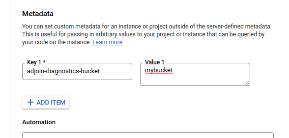

# Automatically joining VMs to Active Directory

This repository contains the code of the `register-computer` Cloud Run app. This app enables you
to automatically join VM instances to an Active Directory domain. For more information,
see [Configuring Active Directory for VMs to automatically join a domain](https://cloud.google.com/solutions/configuring-active-directory-for-vms-to-automatically-join-the-domain).

The code is organized as follows:

* `register-computer/main.py` contains the entry point of the Cloud Run app and implements the
   logic for both, joining computers to a domain and scavenging stale computer accounts.
* `register-computer/join.ps1` is the PowerShells script that is deliverered to be run by a
   joining computer while executing the _sysprep specialize_ phase.
* `register-computer/ad/` contains code to connect, search, and create computer accounts in
   Active Directory.
* `register-computer/gcp/` contains code to interact with the Compute Engine API.
* `register-computer/kerberos/` contains code to reset computer account passwords by using a
   helper tool, `ksetpwd`.
* `ksetpwd/` contains the code of a helper tool which uses [MIT Kerberos](https://web.mit.edu/kerberos/)
  to reset account passwords in Active Directory.

## Configuration

The `register-computer` app obtains its configuration from the environment and supports the following environment variables:

* `AD_DOMAIN` (required): DNS domain used by Active Directory
* `AD_DOMAINCONTROLLER` (optional): Name or IP of domain controller to use. If not specified, the app will locate a domain controller via DNS automatically. This variable should only be used for testing.
* `AD_USERNAME` (required): Username of Active Directory service user. The user must have permission to manage computer objects in the OUs used for automatic domain joining. The value must be provided in `NETBIOS-DOMAIN\SAM-ACCOUNT-NAME` format, UPNs are not supported.
* `AD_PASSWORD` (optional): Clear-text password of Active Directory service user.  This variable should only be used for testing.
* `SM_PROJECT` (or `SECRET_PROJECT_ID` for backward compatibility): Project ID under which secrets are stored.
* `SM_NAME_ADPASSWORD` (or `SECRET_NAME` for backward compatibility) (required unless `AD_PASSWORD` is used): Name of the secret under which the AD credentials have been stored in Secret Manager.
* `SM_VERSION_ADPASSWORD` (or `SECRET_VERSION` for backward compatibility) (required unless `AD_PASSWORD` is used): Version of the secret under which the AD credentials have been stored in Secret Manager. Defaults to `latest`.

* `FUNCTION_IDENTITY`: (required) Email address of the app's service account.
* `LOGGING_LEVEL` (optional): Logging level for log messages. See [Logging Levels](https://docs.python.org/3/library/logging.html#levels) for acceptable values. The default logging level is set to INFO.

### LDAP over SSL/TLS

If you want to use LDAPS to communicate with Active Directory you will need to pass the following environment variables:

* `USE_LDAPS`: If set to `true` TLS secured LDAP on port 636 will be used when communicating with Active Directory. Defaults to `false`. __Note:__ When using LDAPS and a private Certification Authority make sure the CA public certificate is uploaded to Secret Manager and the `SM_NAME_CACERT` and `SM_VERSION_CACERT` options are set accordingly.
* `SM_NAME_CACERT` (optional see `SM_PROJECT_CACERT`): Name of the secret which holds the certificate trust chain for the Certification Authority in Secret Manager.
* `SM_VERSION_CACERT` (optional see `SM_PROJECT_CACERT`): Version of the secret which holds the certificate trust chain for the Certification Authority in Secret Manager. Defaults to `latest`.

If you are using Google Microsoft Managed AD, [follow the steps in the documentation to enable LDAPS](https://cloud.google.com/managed-microsoft-ad/docs/how-to-use-ldaps).

If you run the app locally, you will need to pass the following, additional environment variables to simulate a
Cloud Run environment:

* `GOOGLE_APPLICATION_CREDENTIALS` (required for testing): Path to a service account key of a service account that permits the app to interact with Compute Engine. 

### Advanced diagnostics

The server side log will provide details on server operations like creating/modifying computer accounts. In some cases additional diagnostics are required. By enabling advanced diagnostics, a network capture will be taken from the join process on the VM that is joining Active Directory and stored to Google Cloud Storage. The storage bucket needs to be created before enabling advanced diagnostics and the VMs' service account needs to have write access to it. Network captures will be stored in the `captures` subdirectory in [PCAP Next Generation (pcapng) Capture file format](https://www.ietf.org/staging/draft-tuexen-opsawg-pcapng-02.html).

Advanced diagnostics can be enabled by setting the `adjoin-diagnostics-bucket` metadata key either on [project level](https://cloud.google.com/compute/docs/metadata/setting-custom-metadata#set-projectwide) or [VM level](https://cloud.google.com/compute/docs/metadata/setting-custom-metadata#set-custom):

## Deciding on the OU structure for joined computers

Set one of the following environment variables (if both or none are set, the app will fail):

* `PROJECTS_DN`: Distinguished name of the OU containing the individual project OUs.
The app places computer accounts into the organizational unit `CN=<project_id>,<PROJECTS_DN>`.
The app does not create the OU. Make sure you create the OU for the target project, before joining its instances.
VM instances whose project does not have an OU `CN=<project_id>,<PROJECTS_DN>` will not be joined to Active Directory.

* `CUSTOM_OU_ROOT_DN`: Distinguished name of an OU that serves as root OU.
The app places computer accounts into organizational units that are descendants of the `<CUSTOM_OU_ROOT_DN>` OU.
Each joined VM instance must add a metadata key `target_ou` (case insensitive) and set it to
an OU (fully qualified) that is a descendant of the `<CUSTOM_OU_ROOT_DN>` OU.
VM instances that lack a `target_ou` metadata key will not be joined to Active Directory.

   The OU cannot be updated once a VM instance has been joined to Active Directory. If you specified the wrong `target_ou` value, do the following:
   * Manually move the computer object to the new OU. 
   * Optionally, update the VM metadata for future reference. The metadata will not be inspected after the computer has already been created.
   * If necessary, move the computer group to the new OU. 
   * If you created a managed instance group (MIG) with the wrong `target_ou` value, create a new instance template, update the MIG, and then manually delete the old group in AD.  

## Testing locally

### Launching the app

You can run `main.py` locally for testing and debugging purposes:

* Create a new Python virtual environment and activate it.
* Install requirements by running `pip install -r requirements.txt`.
* Configure environment variables.
* Run `main.py`. The app will listen on port 5000 by default.

### Invoking the app

To invoke the app, you need a valid ID Token. To obtain one, launch a VM instance and run the following command:

`curl -H "Metadata-Flavor: Google" "http://metadata/computeMetadata/v1/instance/service-accounts/default/identity?audience=https://127.0.0.1:5000/&format=full"`

Given an ID Token, you can send a request to the app:

`curl -H "Authorization: Bearer [ID Token]" -X POST http://127.0.0.1:5000/`

## License

All files in this repository are under the
[Apache License, Version 2.0](LICENSE.txt) unless noted otherwise.
